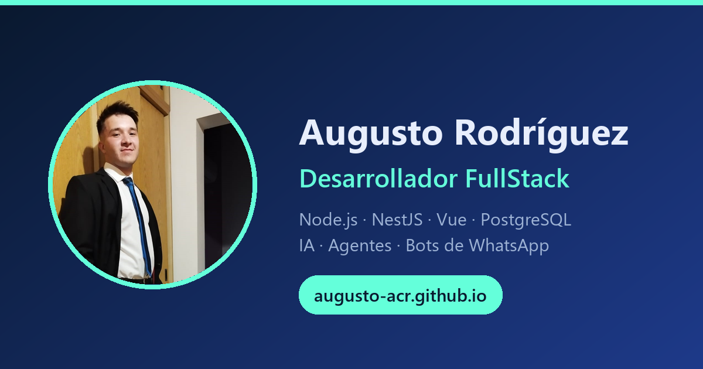

# Portafolio personal — Augusto Rodríguez



Mi portafolio como desarrollador FullStack. **En vivo: [augusto-acr.github.io](https://augusto-acr.github.io/)**

## ✨ Características

- **Responsive** — navbar sticky con menú hamburguesa, grilla adaptable de proyectos y stack
- **Modo claro / oscuro** — con persistencia en `localStorage`, implementado con design tokens (CSS custom properties)
- **Internacionalización ES / EN** — sin frameworks: diccionario de traducciones en `main.js` que actualiza textos, tooltips y `aria-label`
- **Animaciones de entrada** — `IntersectionObserver`, respetando `prefers-reduced-motion`
- **SEO / Open Graph** — metadatos completos y banner 1200×630 para previsualización al compartir
- **Cero dependencias de build** — HTML + CSS + JavaScript vanilla; los logos del stack son SVG locales (Devicon)

## 🛠️ Hecho con

`HTML5` · `CSS3` (custom properties, grid, clamp) · `JavaScript` vanilla · `GitHub Pages`

## 📁 Estructura

```
index.html      → estructura y contenido
Styles.css      → estilos: tokens, temas, grilla, responsive
main.js         → i18n ES/EN, tema, navegación, animaciones
icons/          → logos del stack (SVG locales)
favicon.svg     → favicon monograma "AR"
og-banner.png   → imagen de previsualización para redes
```

## 🚀 Correr localmente

```bash
python -m http.server 5500
```

Después abrir [http://localhost:5500](http://localhost:5500).

## 📬 Contacto

- **LinkedIn:** [Augusto César Rodríguez](https://www.linkedin.com/in/augusto-c%C3%A9sar-rodr%C3%ADguez-7381ba290/)
- **GitHub:** [@Augusto-ACR](https://github.com/Augusto-ACR)
- **Email:** augustocrodriguez2004@gmail.com
